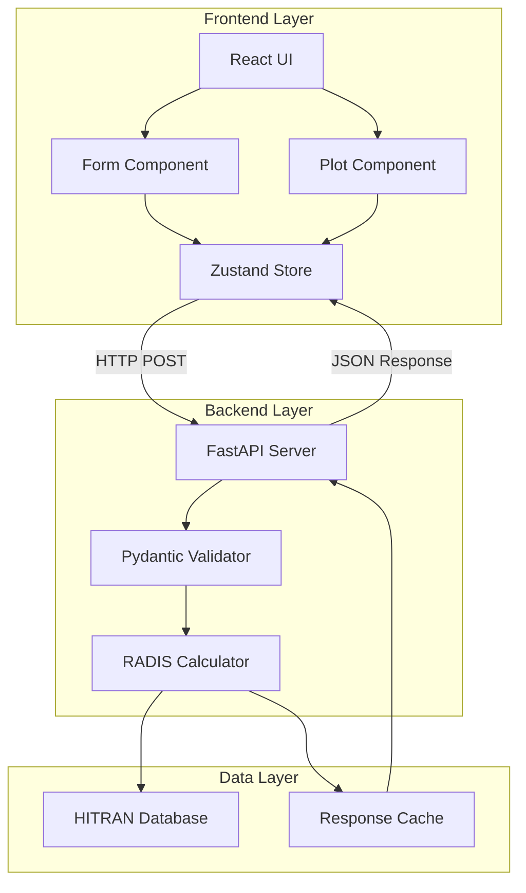
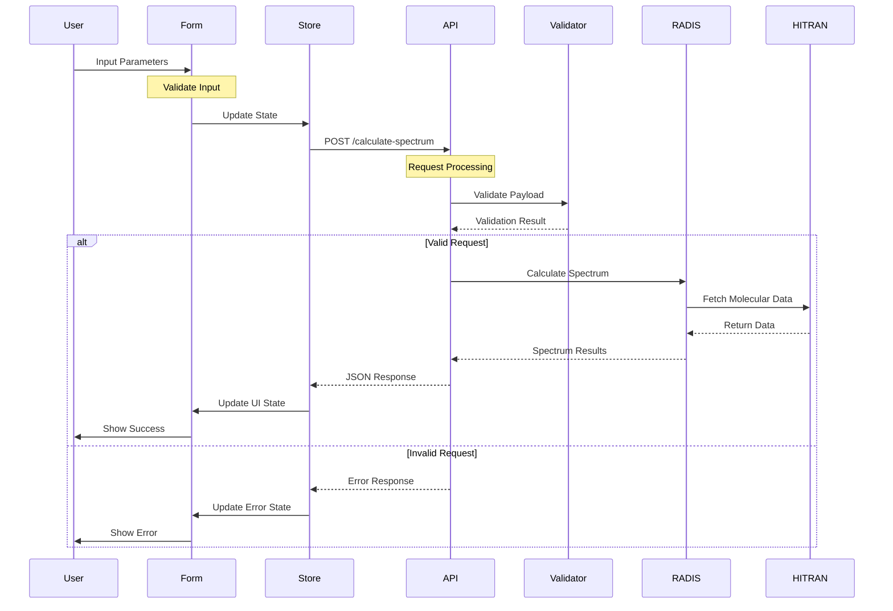
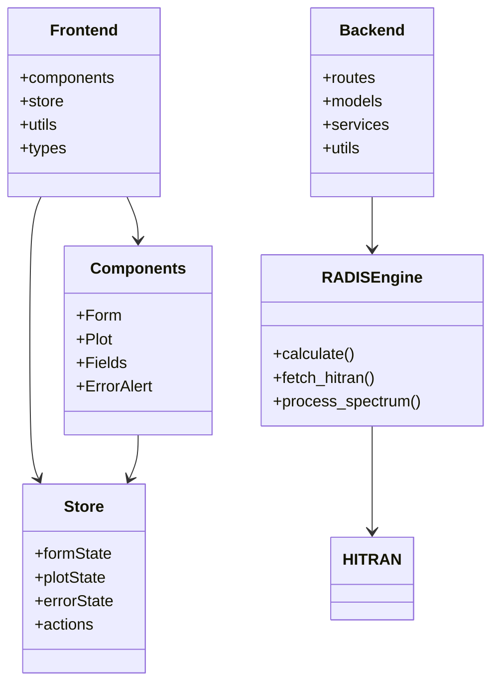
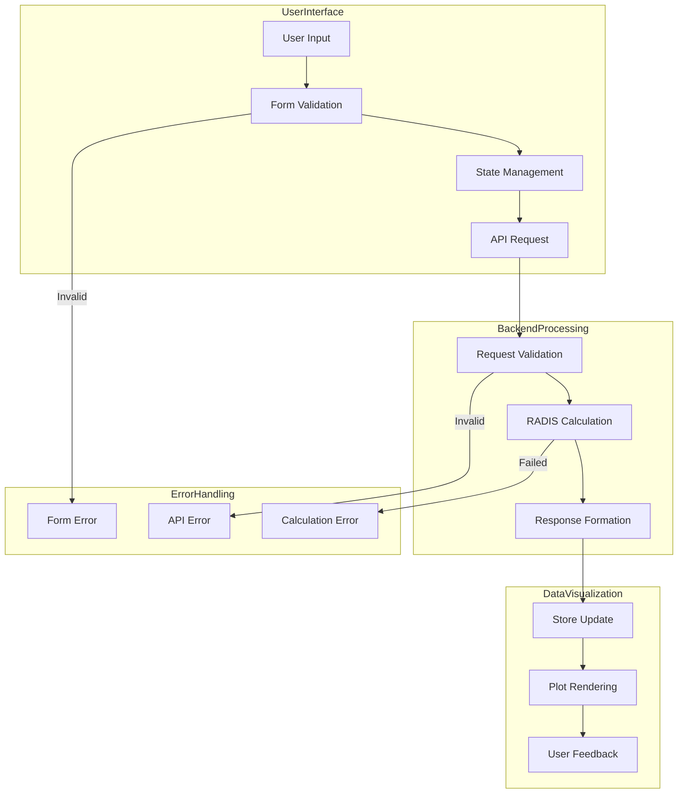

# RADIS App Architecture

## System Overview

### High-Level Architecture

### Request-Response Flow

### Component Architecture

### Data Flow Architecture

## Component Details

### Frontend Components
- **Form**: Main form component handling user input and validation
- **Fields**: Sub-components for specific form inputs (molecule, wavelength, etc.)
- **Plot**: Spectrum visualization component
- **PlotSpectra**: Component for managing multiple spectra plots
- **ErrorAlert**: Error display component
- **Header**: Application header with navigation
- **InfoPopover**: Information tooltips for form fields
- **DownloadButtons**: Components for downloading spectrum data
- **Store**: Zustand store for managing application state

### Backend Components
- **FastAPI Router**: Handles HTTP requests and routing
- **Models**: Pydantic models for request/response validation
- **Helpers**: Utility functions and calculations
- **Constants**: Application constants and configurations
- **RADIS Engine**: Integration with RADIS for spectrum calculations
- **Cache Layer**: Response caching for optimization

