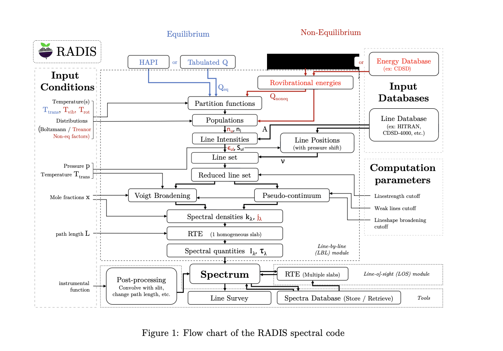
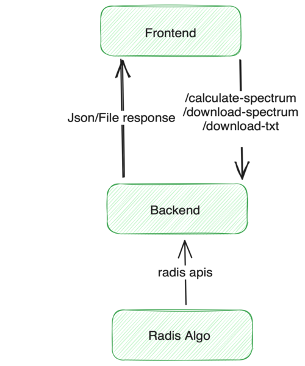
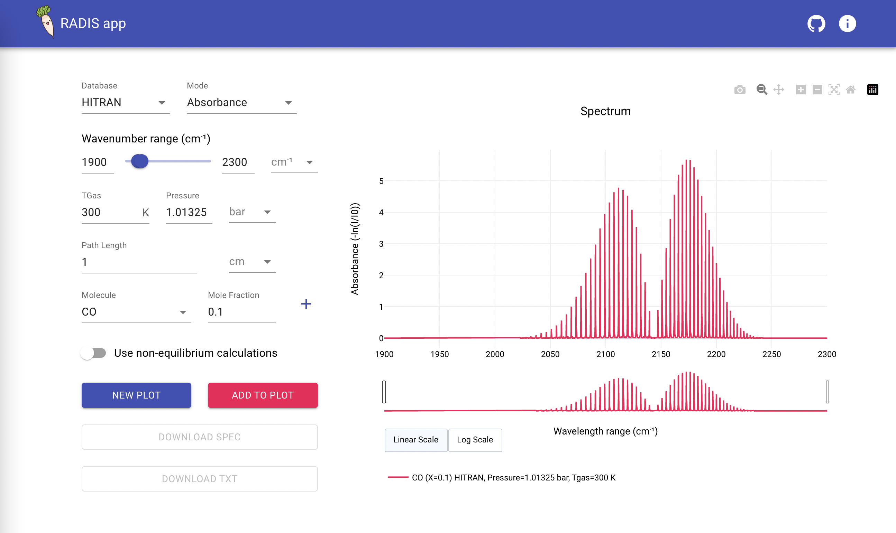
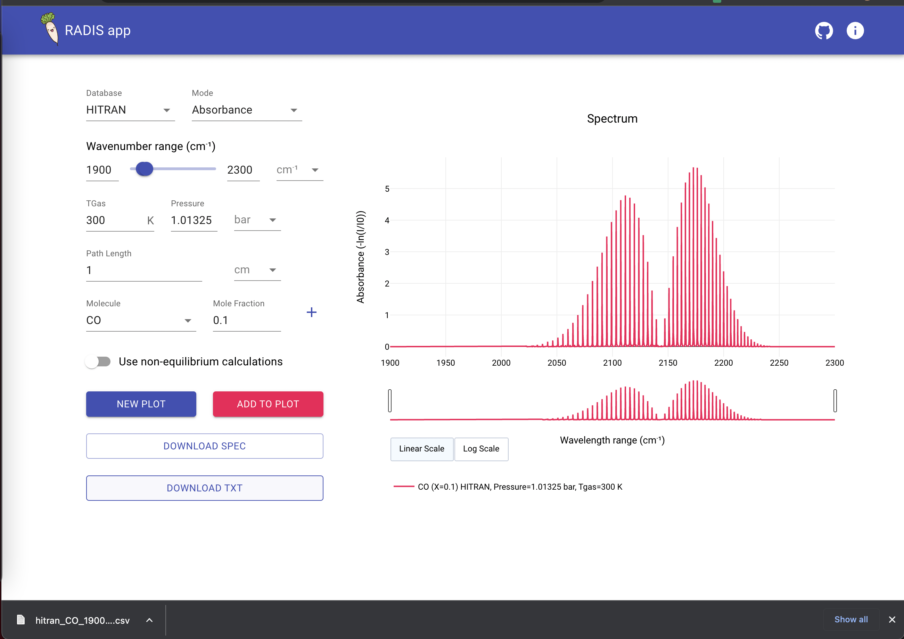
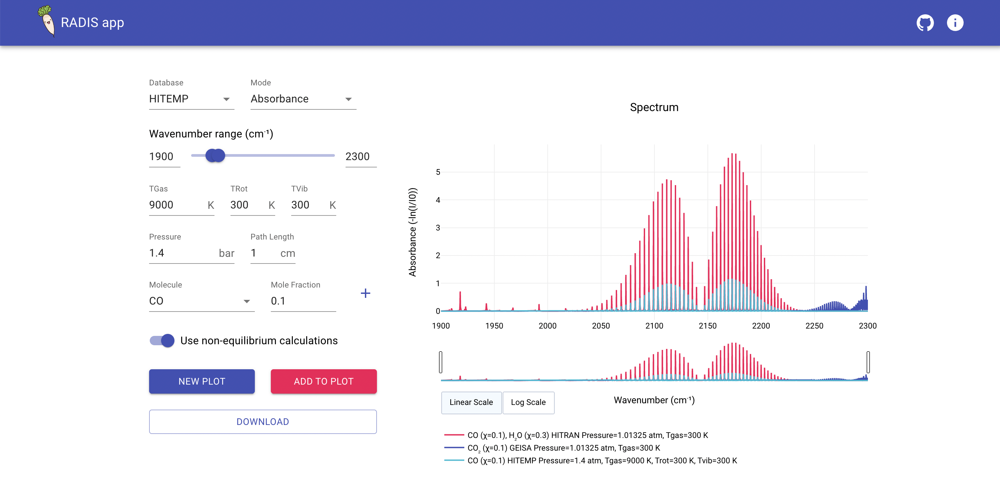

# Summary

**Radis App** is a web application for Radis high-resolution infrared molecular spectra. Instead of writing code, this project aims to create an intuitive user interface (UI).
It use Radis internally to produce spectrum, and the updated version and Radis algorithm make it incredibly efficient to compute the millions of lines in only a few minutes.
Radis app leverages React 18 to offer the user interface, and FastApi on the backend. We are using react-hook-form for the fastest user experience and to maintain performance on the client slide. In the backend, we use FastApi to offer the fastest response.

# Statement of need

We build  **Radis App** to  address an important need in the field of high-resolution infrared molecular spectroscopy. Traditional approaches for analyzing  molecular spectra often involve complex coding and lack intuitive user interfaces, leading to barriers for researchers and practitioners in effectively utilizing this valuable data.

The Radis app fills this gap by providing a user-friendly web application that leverages the power of the Radis algorithm. By abstracting  the need for coding, the Radis app enables researchers to efficiently generate high-resolution spectra with ease. This not only saves significant time and effort but also opens up opportunities for a wider range of users to explore and analyze molecular spectra.
The ability of the Radis app to plot spectra, export them, and overlay multiple spectra for comparative analysis further enhances its usefulness. This comprehensive set of features caters to the diverse needs of researchers working in various fields, ranging from atmospheric science to chemical engineering.

# App Architecture

- **Radis Architecture -**

- **Radis App Architecture -**

# Features

The Radis app offers several key features that enhance the user experience and facilitate efficient analysis of high-resolution infrared molecular spectra. These features includes -

1. **Plotting Spectra**: The app allows users to plot the generated spectra visually. This feature provides a clear and concise representation of the spectral data, enabling researchers to easily analyses and interpret the results. Visualizations can be customized and adjusted to meet specific requirements, enhancing data comprehension and facilitating further analysis.

2. **Exporting Spectra**: The Radis app enables users to export the generated spectra in various formats, such as CSV and Spec files. This feature allows researchers to save and share the spectra for further analysis, publication, or collaboration with peers. The ability to export spectra enhances reproducibility and enables seamless integration with other tools and packages.

3. **Overlaying Spectra**: The app offers the capability to overlay multiple spectra for comparative analysis. Researchers can compare different spectra on a single plot, facilitating the identification of patterns, differences, and correlations between different molecular species or experimental conditions.

Overall, the combination of plotting spectra, exporting spectra, and overlaying spectra in the Radis app provides researchers with powerful tools to explore, analyze, and visualize high-resolution infrared molecular spectra effectively

# Acknowledgements
We acknowledge contributions and support from Erwan Pannier during the genesis of this project.

# References
